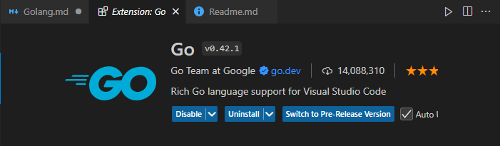

# Golang User Manual

## Install Go

1. [Golang 공식 사이트](https://go.dev/dl/) 에서 다운로드
2. 환경변수 설정
   1. go 설치경로 (Default: C:\Program Files\Go) 를 GOPATH로 설정
   2. 환경변수 PATH에 %GOPATH%\bin 확인
   3. go env 통해 올바르게 설정되었는지 확인

## Version

* cmd
  ``` cmd
  go version
  ```
* current version: go version go1.23.2
  
## IDE Settings

### IDE
visual studio code

다음과 같이 workspace 설정을 해줍니다.

``` json
	"settings": {
      "go.gopath": "C:\\Users\\2017387\\go",
      "go.formatTool": "gofmt",
      "go.useLanguageServer": true
	}
```

### Extension
Go


### Install Update Packages

```Ctrl+Shift+P```를 눌러 “Go: Install/Update Tools”를 검색하여 목록에서 필요한 패키지를 설치한다

* gopls (Go Language Server):
  * VS Code와 같은 IDE에서 Go 코드를 편집할 때 도움을 주는 언어 서버입니다. 
  * 코드 자동 완성, 정의로 이동, 타입 정보, 리팩토링 기능을 제공하여 생산성을 크게 높여줍니다.
* dlv (Delve):
  * Go 프로그램을 디버깅하기 위한 도구입니다. 
  * dlv를 설치하면 VS Code에서 Go 코드를 단계별로 실행하며 변수 상태를 살펴보는 등 디버깅 작업이 가능해져요.

## Initialize Project

### 프로젝트 생성

* cmd에서 ```go mod init ${프로젝트 이름}``` 명령을 통해 모듈을 초기화 합니다.

``` bash
mkdir ${Project Name}
cd ${Project Name}
go mod init http://code.vieworks.com/etc/ProjectName
or
go mod init ${Project Name}
```

📘 **프로젝트 이름**: 소문자와 - 를 조합하여 만듭니다. 

(Why? URL 경로에서 사용, Unix/Linux 스타일과 일관성, Go 커뮤니티 컨벤션)

### 패키지 종속성 관리

Go Modules를 통해 프로젝트별 종속 패키지를 관리합니다. 

go.mod 파일과 go.sum 파일을 통해 프로젝트 종속성을 정의하고, 각 프로젝트는 독립적인 종속성을 가집니다.

#### 1. Go Module 초기화

```go mod init``` 명령을 실행하여 Go Modules을 초기화하고 *go.mod* 파일을 생성합니다.

``` bash
go mod init ${Project Name}
```
#### 2. Dependency (Packages) 추가

```go get``` 명령어를 사용하여 종속 패키지를 설치합니다. 

이를 통해 패키지가 *go.mod*와 *go.sum* 파일에 기록되고, 프로젝트가 해당 패키지를 사용할 수 있습니다.

``` bash
go get github.com/gin-gonic/gin
```
#### 3. Package 정리 및 업데이트

프로젝트가 확장되거나 필요하지 않은 패키지가 생길 경우 ```go mod tidy```명령어로 *go.mod*와 *go.sum* 파일을 자동으로 정리할 수 있습니다.

```
go mod tidy
```
#### 4. 버전관리

```go get```을 통해 특정 버전으로 패키지를 업데이트하거나 다운그레이드 할수 있습니다.

``` bash
go get github.com/gin-gonic/gin@v1.6.3

```